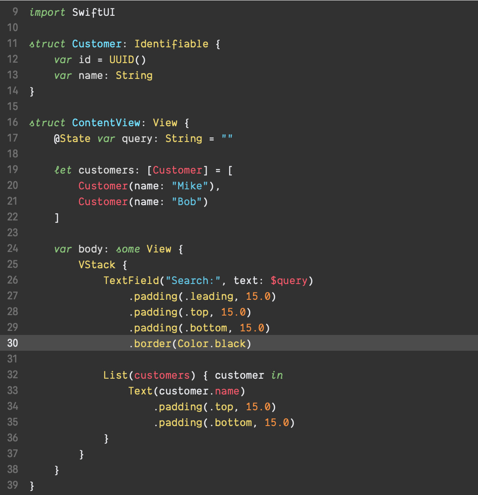

# an-old-hope-xcode

A port of [Jesse Leite's Atom syntax](https://github.com/jesseleite/an-old-hope-syntax-atom) theme for xcode

The font used is [Dank Mono](https://dank.sh/)

# How to use

Copy the contents/download the file and place it in `/Users/<user>/Library/Developer/Xcode/UserData/FontAndColorThemes/`

Note: This directory might only exist once you created / altered a theme.

Go to `Editor > Theme > Edit Themes...` to select it.

